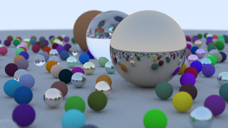

# Ray Tracing in One Weekend (in Julia)

[Ray Tracing in One Weekend](https://raytracing.github.io/books/RayTracingInOneWeekend.html) in Julia, also as a [Notebook](Raytracing.ipynb)

There's also a version [in Rust](https://github.com/shritesh/raytrace-rs) and [Roc](https://github.com/shritesh/raytrace.roc).
